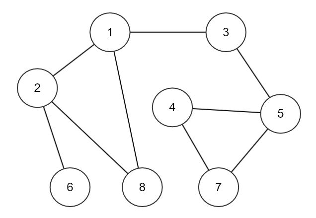

# DFS/BFS

📌 그래프의 특정 노드에서 시작하여 전체 노드를 탐색하는 알고리즘

-  깊이 우선 탐색 (DFS, Depth First Search)
-  너비 우선 탐색 (BFS, Breadth First Search)

** 그래프 탐색의 경우 **어떤 노드를 방문했었는지 여부를 반드시 검사** 해야 함, 그렇지 않을 경우 무한루프에 빠질 위험이 있음

<br>

# DFS (Depth First Search)


## 💎 Tips

📌 탐색을 할 때 **시작 정점에서 한 방향으로 계속 가다가** 더 이상 갈 수 없게 되면, **다시 가장 가까운 갈림길로 돌아와서** 다른 방향으로 다시 탐색을 진행하는 방식


- 검색 속도는 너비 우선 탐색보다는 느림
<br>


## 🏷️ Manual

[ 구현 순서 ] 

1. 인접한 정점이 존재하는지 데이터를 입력받을 때 표시 (ex. graph[j][k] =1 )
2. 해당 지점에 방문했는지 체크해주는 배열을 만듦 (ex. 방문전 dfs_arr[0][1] = 0 -> 방문 후 dfs_arr[0][1] = 1)
3. 인접한 정점이 존재한다면 계속 한 우물만 깊게 파고드는 알고리즘
4. 만약, 인접한 정점이 막다른 길에 부딪힌다면, 이 전에 있었던 정점으로 돌아가서 또 새로운 우물이 있는지 봄

[ 구현 방식 ]

1. 재귀(Recursion)
2. 스택(Stack)
<br>

---

### 예시코드 (DFS)
```c
void DFS(int** graph, int N, int START, int** dfs_arr) {
	printf("%d", START);
	// printf("%d", *(*dfs_arr+START));
	// printf("%d", dfs_arr[0][START]);

	*(*dfs_arr + START) = 1;
	for (int i = 1; i < N + 1; i++) {
		if (graph[START][i] == 1 && dfs_arr[0][i] == 0) {
			DFS(graph, N, i, dfs_arr);  // dfs_arr 주솟값 자체를 보냄
		}
	}
	return;
}

```

### 예시코드2 (DFS 적용 코드)
```c
#include <stdio.h>
#include <stdlib.h>

int main() {
	int N, M, V;
	int** graph;
	int j, k;

	scanf("%d %d %d", &N, &M, &V);

	int* dfs_arr = (int*)calloc(N + 1, sizeof(int));

	graph = (int**)malloc(sizeof(int*) * (N + 1));

	for (int i = 0; i < N + 1; i++) graph[i] = (int*)calloc(N + 1, sizeof(int));

	for (int i = 0; i < M; i++) {
		scanf("%d %d", &j, &k);
		graph[j][k] = 1;
		graph[k][j] = 1;
	}

	DFS(graph, N, V, &dfs_arr); // 이차원 배열처럼 dfs_arr 주솟값 자체를 보냄

	for (int i = 0; i < M; i++) free(graph[i]);

	free(graph);
	free(dfs_arr);

	return 0;
}

```

<br>

# BFS (Breadth First Search)


## 💎 Tips

📌 탐색을 할 때 시작 정점에서 **인접한 노드를 먼저 탐색**하여, 가까운 정점을 먼저 방문하고 멀리 **떨어진 정점을 나중에 방문**하는 방식


- Level을 높여가면서 각각의 정점을 탐색해 나가는 알고리즘
- 그래프의 크기가 작을 경우 : BFS가 더 유리
<br>


## 🏷️ Manual

[ 구현 순서 ] 



1. 큐에 처음 시작할 기준 노드를 넣고 방문 처리합니다.
     (여기서 방문처리라는 것은 내가 해당 노드에 방문했음을 기록하는 것)

2. 1번의 기준 노드와 가까운 노드를 큐에 넣고 방문 처리합니다. (인접한 노드 모두를 넣음 -> ex, 2, 3, 8 순서)
3. 큐에서 노드를 하나 꺼냅니다.
4. 연결된 노드가 없으면 3번으로 다시 돌아갑니다.
5. 연결된 노드가 있고 방문하지 않았으면 큐에 넣고 방문처리 후 3번으로 돌아갑니다.
6. 연결된 노드가 있지만 방문을 이미 한 경우에는 3번으로 돌아갑니다.
7. 3~6을 큐가 빌 때까지 반복하며 큐가 비었으면 종료합니다.

이러한 순서로 BFS를 진행하면 위의 그래프에서 탐색 순서는 다음과 같습니다.
  1 -> 2 -> 3 -> 8 -> 6 -> 5 -> 4 -> 7

[ 구현 방식 ]

1. 큐(Queue)
<br>

---

### 예시코드 (BFS)
```c
void BFS(int*** graph, int N, int START, int** bfs_arr) {
	Queue queue;
	InitQueue(&queue);
	
	Enqueue(&queue, START);
	printf("%d ", START);
    bfs_arr[0][START] = 1;
	
	while (!IsEmpty(&queue)) {
		int Pop = Dequeue(&queue);
		for (int i = 1; i <= N; i++) {
			if (graph[0][Pop][i] == 1 && bfs_arr[0][i] == 0) {
				printf("%d ", i);
				Enqueue(&queue, i);
				bfs_arr[0][i] = 1;
			}
		}
	}

	return;
}

```

### 예시코드2 (BFS 적용 코드)
```c
#include <stdio.h>
#include <stdlib.h>
#include "Queue.h"

int main() {
	int N, M, V;
	int** graph;
	int j, k;

	scanf("%d %d %d", &N, &M, &V);

	int* bfs_arr = (int*)calloc(N + 1, sizeof(int));

	graph = (int**)malloc(sizeof(int*) * (N + 1));

	for (int i = 0; i < N + 1; i++) graph[i] = (int*)calloc(N + 1, sizeof(int));

	for (int i = 0; i < M; i++) {
		scanf("%d %d", &j, &k);
		graph[j][k] = 1;
		graph[k][j] = 1;
	}
	
	BFS(&graph, N, V, &bfs_arr);

	for (int i = 0; i < M; i++) free(graph[i]);

	free(graph);
	free(bfs_arr);

	return 0;
}

```
